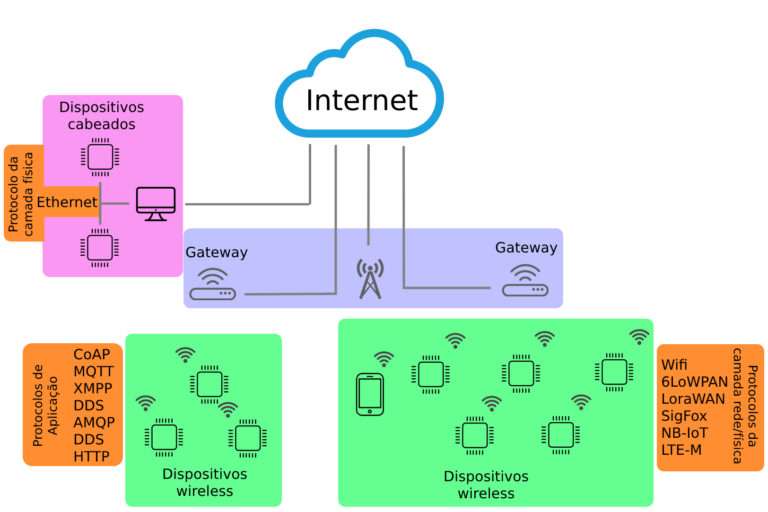
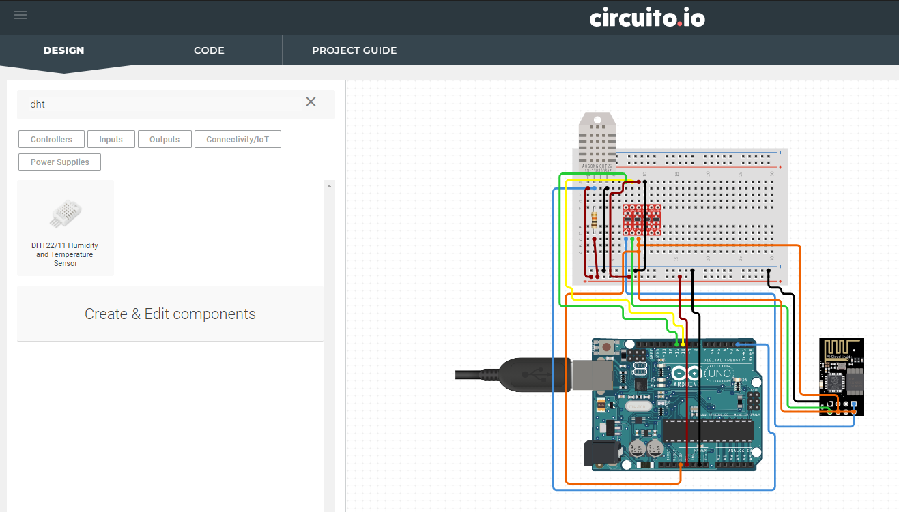
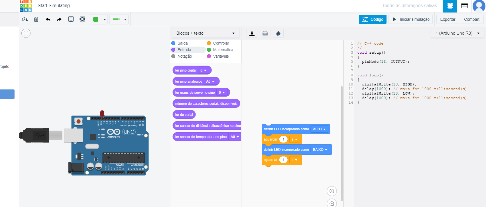
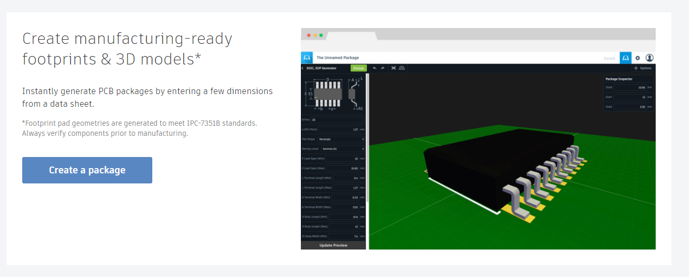
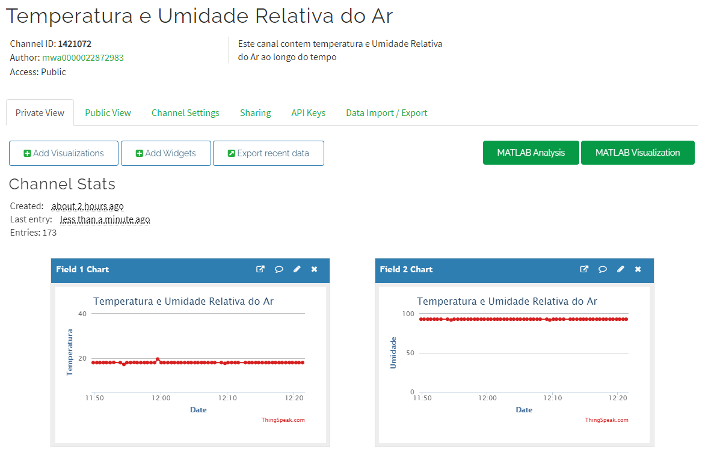

# iot

## Protocols

- https://github.com/eduardomioto/iot/blob/main/mqtt.md
- https://www.filipeflop.com/blog/conheca-os-principais-protocolos-para-iot/

### Hardware 

#### Módulo WiFi ESP8266 NodeMcu ESP-12

- https://github.com/eduardomioto/iot/blob/main/nodemcu.md

### Arduino

Link: https://www.embarcados.com.br/mqtt-dash/

#### Testing and Learning

- circuito.io: https://www.circuito.io/app

- tinkercad: https://www.tinkercad.com/dashboard?type=circuits&collection=designs

### Troubleshooting

- Check ports on windows: https://docs.microsoft.com/en-us/sysinternals/downloads/tcpview
- Chrome MQTT Client: https://chrome.google.com/webstore/detail/mqttbox/kaajoficamnjijhkeomgfljpicifbkaf?hl=pt-BR

### 3D Modeling

- library.io: https://library.io/

### References 

- https://www.embarcados.com.br/temperatura-e-umidade-no-mqtt-dash-dht11/
- https://produto.mercadolivre.com.br/MLB-1345351458-display-oled-128x64-096-i2c-grafico-arduino-azul-e-amarelo-_JM#position=1&search_layout=grid&type=item&tracking_id=509bb6b2-eca7-40bd-8f61-dff2cdb811ad
- learning with fritzing: https://fritzing.org/learning/
- https://www.blogdarobotica.com/2020/07/14/monitorando-temperatura-e-umidade-pelo-celular-utilizando-a-plataforma-blynk/
- https://create.arduino.cc/projecthub/Ninety99/small-covid-medi-kit-spo2-heart-rate-ecg-with-matlab-1d9a12?ref=platform&ref_id=424_trending_part__&offset=0

### Social 

- https://www.instructables.com/
- https://www.hackster.io/
- Per Platform: https://www.hackster.io/channels/platforms?ref=topnav

### Platforms
- https://blynk.io/

- https://thingspeak.com/
- Public (example): https://thingspeak.com/channels/1421072

