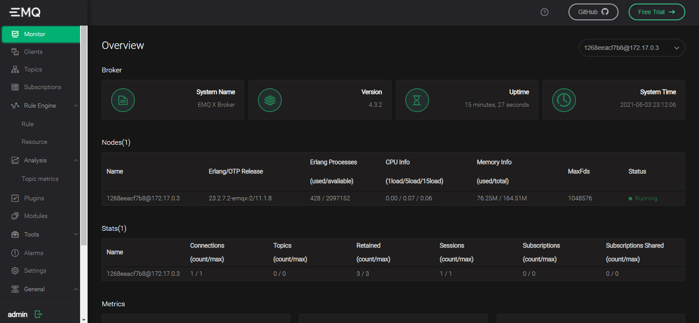

# iot

## Software

### MQTT - Cloud-Based

Link: https://www.cloudmqtt.com/

### MQTT - On-Premisse (EMQ X)
EMQ X connects any IoT device via all major IoT communication protocols, including MQTT v5.0, CoAP/LwM2M 1.1 and even LoraWAN, over 3G/4G/5G&NB-IoT networks, and ensures security via TLS/DTLS, X.509 certificate, and diverse authentication mechanism

```
# docker rm emqx
docker run -d --name emqx \
           -p 1883:1883   \
           -p 8081:8081   \
           -p 8083:8083   \
           -p 8084:8084   \
           -p 8883:8883   \
           -p 18083:18083 \ 
           -p 4369:4369   \
           -e EMQX_LOADED_PLUGINS="emqx_recon,emqx_retainer,emqx_management,emqx_dashboard" \
           emqx/emqx:4.3.2
```


|Protocol  | Port  |
|--|--|
| mqtt:tcp	|	1883 |
| http:management | 8081 |
| mqtt:ws | 8083 | 
| mqtt:wss |	8084 |
|mqtt:ssl  | 8883 |
| http:dashboard | 	18083 |


**Dashboard**
Link: http://localhost:18083/#/login
```
USER: admin
PASS: public
```



### Hardware 

#### Módulo WiFi ESP8266 NodeMcu ESP-12

O módulo Wifi ESP8266 NodeMCU é uma placa de desenvolvimento que combina o chip ESP8266, uma interface usb-serial e um regulador de tensão 3.3V. A programação pode ser feita usando LUA ou a IDE do Arduino, utilizando a comunicação via cabo micro-usb. 

Link:
- https://www.filipeflop.com/produto/modulo-wifi-esp8266-nodemcu-esp-12/
- https://produto.mercadolivre.com.br/MLB-1211973537-esp8266-nodemcu-v3-esp12-wifi-80211-bgn-arduino-lua-_JM#position=1&search_layout=grid&type=item&tracking_id=774da34b-9223-4908-9ff3-0d96b602fca1
- 
### Arduino

Link: https://www.embarcados.com.br/mqtt-dash/

#### Testing and Learning

- circuito.io: https://www.circuito.io/app
- tinkercad: https://www.tinkercad.com/dashboard?type=circuits&collection=designs
- fritzing: https://fritzing.org/learning/

### Troubleshooting

- Check ports on windows: https://docs.microsoft.com/en-us/sysinternals/downloads/tcpview
- Chrome MQTT Client: https://chrome.google.com/webstore/detail/mqttbox/kaajoficamnjijhkeomgfljpicifbkaf?hl=pt-BR

### 3D Modeling

- library.io: https://library.io/

### References 

- https://www.embarcados.com.br/temperatura-e-umidade-no-mqtt-dash-dht11/
- https://produto.mercadolivre.com.br/MLB-1345351458-display-oled-128x64-096-i2c-grafico-arduino-azul-e-amarelo-_JM#position=1&search_layout=grid&type=item&tracking_id=509bb6b2-eca7-40bd-8f61-dff2cdb811ad
