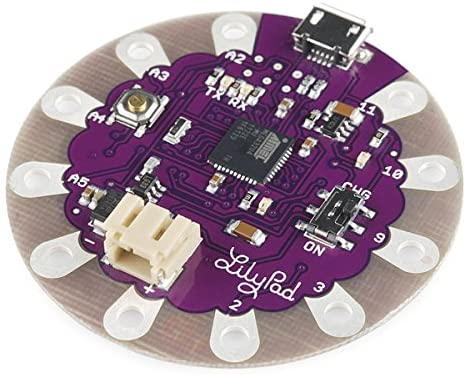
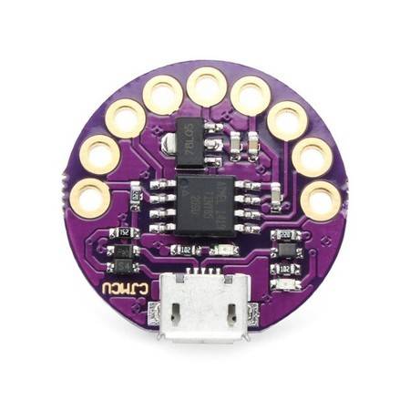

# LilyPad 

### LilyPad Board

####  Lilypad 3.3V ATMega32U4

- Modelo: Lilypad 3.3V
- Microcontrolador ATMega32U4
- Clock: 8MHz
- Tensão de Operação: 3.8V à 5V
- Nível de sinal nos pinos: 3.3V
- Pinos de I/O: 9 (4 podem ser usados como PWM e 4 como entrada analógica)
- Corrente por pino: 40mA
- Memória Flash: 32K
- SRAM: 2,5KB
- EEPROM: 1K
- Dimensões: 50 x 7mm

#### Lilytiny

**Descrição Técnica:**

- Modelo: Lilytiny;
- Microcontrolador: Atmel ATtiny85;
- Suporte para o Arduino IDE 1.0+ (OSX / Win / Linux);
- Alimentação: USB ou fonte externa 7-16V;
- Comunicação: Suporte SPI / TWI;
- Interface: Micro USB;
- Pinos: 6 I/O;
- Memória Flash: 8 KB;
- SRAM: 512 bytes;
- EEPROM: 512 bytes;
- Diâmetro: 25 mm;
- Peso: 2g.

## Buying

#### Lilypad 3.3V ATMega32U4: 
- https://www.filipeflop.com/produto/placa-lilypad-3-3v-atmega32u4/
- https://www.silvatronics.com.br/pd-499d92-arduino-lilypad.html?ct=16bb33&p=1&s=1

#### Lilytiny
- https://www.filipeflop.com/produto/placa-lilytiny-lilypad/
- https://www.silvatronics.com.br/pd-50a2fb-arduino-lilipad-lilytiny.html?ct=16bb33&p=1&s=1

#### Linha Condutiva
- https://www.filipeflop.com/produto/linha-condutiva-wearable-1m/

### References
- https://www.filipeflop.com/blog/sketchs-na-lilytiny-com-arduino-uno/
- https://www.filipeflop.com/blog/conheca-a-lilypad-usb/
- https://www.emiliapucci.com/week-9-e-textilesandwearables2
