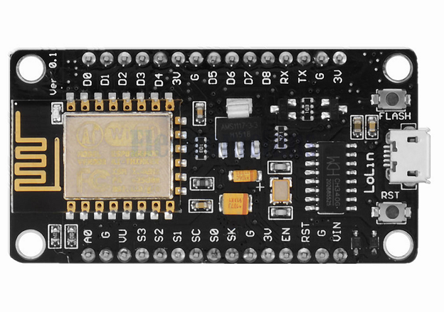

# iot - NodeMCU

#### Módulo WiFi ESP8266 NodeMcu ESP-12

O módulo Wifi ESP8266 NodeMCU é uma placa de desenvolvimento que combina o chip ESP8266, uma interface usb-serial e um regulador de tensão 3.3V. A programação pode ser feita usando LUA ou a IDE do Arduino, utilizando a comunicação via cabo micro-usb. 

Link:
- https://www.filipeflop.com/produto/modulo-wifi-esp8266-nodemcu-esp-12/
- https://produto.mercadolivre.com.br/MLB-1211973537-esp8266-nodemcu-v3-esp12-wifi-80211-bgn-arduino-lua-_JM#position=1&search_layout=grid&type=item&tracking_id=774da34b-9223-4908-9ff3-0d96b602fca1

### Node MCU Board

- V3

O NodeMCU V3 é produzido pela Lolin e possui as mesmas características do V2, contudo, tem uma largura maior, e isto impossibilita que a placa seja inserida em uma protoboard. Além disso, esta versão conta com o conversor USB serial CH340.

- V2

A segunda geração do NodeMCU sofreu algumas melhorias e inclusive redução das dimensões. O ESP-12 foi atualizado para o ESP-12E. Além disso, esta versão se encaixa perfeitamente em uma protoboard, pois o espaçamento entre os pinos é de 2.54mm.

A versão 2 do NodeMCU é produzida pela Amica e o conversor USB serial utilizado é o CP2102 da Silabs.

- V1

A primeira geração do NodeMCU está desatualizada e a mesma possui um ESP-12. Além disso, esta versão possui dimensões consideradas grandes, se comparada as versões posteriores.

### Pinagem do NodeMCU

### Integrating with Arduino

### Instruções

- https://www.filipeflop.com/blog/programar-nodemcu-com-ide-arduino/
- https://www.blogdarobotica.com/2020/05/28/como-programar-a-placa-nodemcu-esp8266-no-arduino-ide/
- https://blogmasterwalkershop.com.br/embarcados/nodemcu/nodemcu-instalacao-no-windows
- https://create.arduino.cc/projecthub/electropeak/getting-started-w-nodemcu-esp8266-on-arduino-ide-28184f
- https://www.filipeflop.com/blog/programar-nodemcu-com-ide-arduino/
- https://mechatronicsblog.com/basic-esp8266-nodemcu-tutorial-breadboard-pinout-and-dimmable-led-with-pulse-width-modulation-pwm/

### Referencias
- https://blogmasterwalkershop.com.br/embarcados/nodemcu/nodemcu-uma-plataforma-com-caracteristicas-singulares-para-o-seu-projeto-iot
